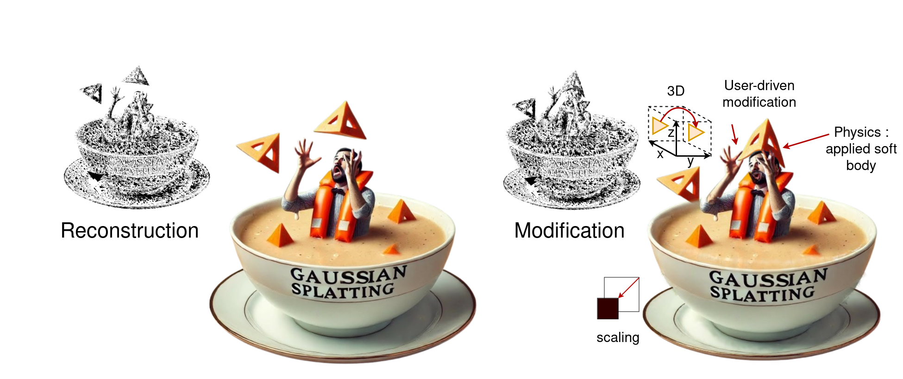
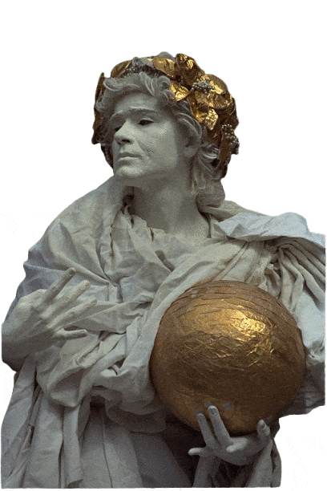
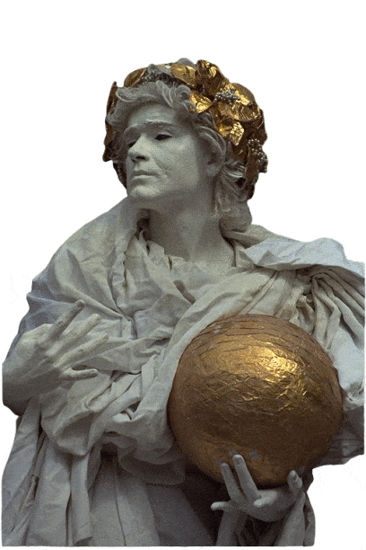
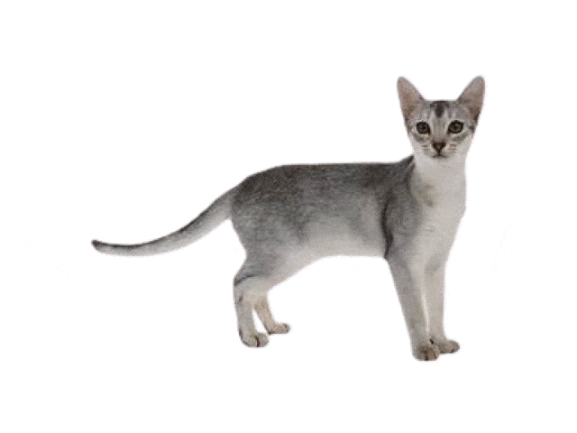
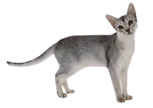

<p align="center">

</p>


# MiraGe: Editable 2D Images using Gaussian Splatting
Joanna Waczyńska, Tomasz Szczepanik, Piotr Borycki, Sławomir Tadeja, Thomas Bohné, Przemysław Spurek

Implicit Neural Representations (INRs) approximate 
discrete data through continuous functions and are 
commonly used for encoding 2D images. Traditional image-based 
INRs employ neural networks to map pixel coordinates to RGB values, 
capturing shapes, colors, and textures within the network’s weights. 
Recently, GaussianImage has been proposed as an alternative,
using Gaussian functions instead of neural networks to achieve 
comparable quality and compression. Such a solution obtains a
quality and compression ratio similar to classical INR models 
but does not allow image modification. In contrast, our work introduces a novel method, \our{}, which uses mirror reflections to perceive 2D images in 3D space and employs flat-controlled Gaussians for precise 2D image editing. Our approach improves the rendering quality and allows realistic image modifications, including human-inspired perception of photos in the 3D world. Thanks to modeling images in 3D space, we obtain the illusion of 3D-based modification in 2D images. We also show that our Gaussian representation can be easily combined with a physics engine to produce physics-based modification of 2D images. 
Consequently, MiraGe allows for better quality than the standard approach and natural modification of 2D images.

</br>

</br>

<p>


</p>

# Installation

Since, the software is based on original Gaussian Splatting repository, for details regarding requirements,
we kindly direct you to check  [3DGS](https://github.com/graphdeco-inria/gaussian-splatting). Here we present the most important information.

### Requirements

- Conda (recommended)
- CUDA-ready GPU with Compute Capability 7.0+
- CUDA toolkit 11 for PyTorch extensions (we used 11.8)

## Clone the Repository with submodules

```shell
# SSH
git clone https://github.com/waczjoan/MiraGe.git --recursive
```
or
```shell
# HTTPS
git clone https://github.com/waczjoan/MiraGe.git --recursive
```

### Environment
#### Local Setup

To install the required Python packages we used 3.8 python and conda v. 24.5.0
```shell
conda env create --file environment.yml
conda mirage
```

Common issues:
- Are you sure you downloaded the repository with the --recursive flag?
- Please note that this process assumes that you have CUDA SDK **11** installed, not **12**. if you encounter a problem please refer to  [3DGS](https://github.com/graphdeco-inria/gaussian-splatting) repository.

# Dataset

Feel free. You can choose whatever 2D image you want (`.png`).

Under the  [LINK](https://ujchmura-my.sharepoint.com/:f:/g/personal/joanna_waczynska_doctoral_uj_edu_pl/EmeuuK0PMzNJtXCFDglxGYwBISkbL-UyeVSQcfIwd-ASHA?e=RmSsYs) please find pre-trained model and cat image (there is already flipped cat image in `data/cat`).


# Tutorial

1. Example 2D image illustrated cat (`example.png`) put to folder: 

```
<MiraGe>
|---data
|   |---<cat>
|   |   |example.png
|---train.py
|---metrics.py
|---...
```

2. Train MiraGe.

We conducted an extensive analysis of the MiraGe model due to its unique ability to control the
behavior of Gaussians. Three distinct settings for Gaussian movement were explored.

- `gs_type`:
    - `amorphous`: the first allows Gaussians to move freely in 3D space,
    - `2d`: the second restricts their movement to align parallel to the XZ plane
    - `graphite`: the third confines all Gaussians to the XZ plane, effectively creating a 3D representation

- `camera`: 
    - `one`: baseline. use only one camera.
    - `mirror`: first camera is tasked with reconstructing the original image, while the second models the mirror
reflection. 

`distance`: default 1
increasing the camera distance can naturally expand the apparent size of background elements, making it easier to represent them as larger objects without additional modeling complexity. While this feature is beneficial, it is not strictly necessary for most applications.

It should be around 2 minutes:
  ```shell
python train.py -s image_dir -m model_output_path --gs_type amorphous --camera mirror
  ```

  ```shell
python train.py -s data/cat -m output/cat_mirage --gs_type amorphous --camera mirror 
  ```

If you `mirror` camera, in `image_dir` you will find `{image_name}_mirror.png`. In `output/cat_mirage` you should find model: 
```
<MiraGe>
|---data
|   |---<cat>
|   |   |---example.png
|   |   |---example_mirror.png
|   |   |---points3d.obj
|---output
|   |---<cat_mirage>
|   |   |---point_cloud
|   |   |---xyz
|   |   |---cfg_args
|   |   |---...
|---train.py
|---metrics.py
|---...
```

4. Evaluation:

Firstly let's check you we can render Flat Gaussian Splatting:
```shell
  python scripts/render.py -m model_output_path
```
if `gs_type=2d` was used, please use: 
```shell
python scripts/render.py -m model_output_path --gs_type 2d 
```

Then, let's calculate  metrics:
```shell
python metrics.py -m output/hotdog_gs_flat --gs_type gs_flat
```
In `output/cat_mirage` you should find: 
```
<MiraGe>
|---output
|   |---<cat_mirage>
|   |   |---point_cloud
|   |   |---cfg_args
|   |   |---test
|   |   |---<ours_iter>
|   |   |   |---renders_gs_flat
|   |   |---results_gs_flat.json
|   |   |---...
|---metrics.py
|---...
```

you should get:

<p>

</p>

5. Modification:

Simply run:
```shell
  scripts/render_points_time_animated.py -m output/cat_mirage
```
Please find renders in `renders_transform` directory: 
```
<MiraGe>
|---output
|   |---<cat_mirage>
|   |   |---point_cloud
|   |   |---cfg_args
|   |   |---test
|   |   |---<ours_iter>
|   |   |   |---renders_gs_flat
|   |   |   |---renders_transform
|   |   |---...
|---metrics.py
|---...
```

6. User modification:

First save pseudomesh (triangle soup):

```shell
python scripts/save_pseudomesh.py --model_path model_output_path
```

then use Blender or different tool to manipulate faces (triangles).
Save `.obj` file.

If you create more objects (for example simulation), you to render please use:
```shell
python scripts/render_simulation.py  -m model_output_path --simulation_path simulation_path --save_trajectory
```

To render user-driven modification use: 

```shell
python scripts/render_from_object.py  -m model_output_path --object_path object_path.obj
```

We offer a pre-trained cat model [LINK](https://ujchmura-my.sharepoint.com/:f:/g/personal/joanna_waczynska_doctoral_uj_edu_pl/EmeuuK0PMzNJtXCFDglxGYwBISkbL-UyeVSQcfIwd-ASHA?e=RmSsYs), designed "for fun," along with a Blender (.blend) file. 
This file applies a basic lattice modifier to generate the objects stored in the `output/sim_objects` directory. 
Additionally, the triangle soup data for the cat is available in `output/pseudomesh_info`.

Please find renders in `sim_objects` and `sim_objects_traj_path` directory:
```
<MiraGe>
|---output
|   |---<cat_mirage>
|   |   |---point_cloud
|   |   |---cfg_args
|   |   |---test
|   |   |---<ours_iter>
|   |   |   |---renders_gs_flat
|   |   |   |---sim_objects
|   |   |   |---sim_objects_traj_path
|   |   |---...
|---metrics.py
|---...
```

In `output/testsim_objects_traj_path`:
<p>

</p>

In  `output/object/example_modification.obj` please use 

```shell
python scripts/render_from_object.py -m output/cat_mirage --object_path output/object/example_modification.obj
```

In `output/test/example_modification`:
<p>

</p>

# In nutshell:

### Amorphous 

python scripts/train.py -s image_dir -m model_output_path --gs_type amorphous --camera mirror 

python scripts/render.py -m model_output_path --camera mirror --distance 1 

python metrics.py -m model_output_path

------------------------------------
### 2D
python scripts/train.py -s image_dir -m model_output_path --gs_type 2d --camera mirror

python scripts/render.py -m model_output_path --camera mirror --distance 1  --gs_type 2d 

python metrics.py -m model_output_path --gs_type 2d 

------------------------------------
### Graphite

python scripts/train.py -s image_dir -m model_output_path --gs_type graphite  --camera mirror

python scripts/render.py -m model_output_path --camera mirror

python metrics.py -m model_output_path 

------------------------------------
